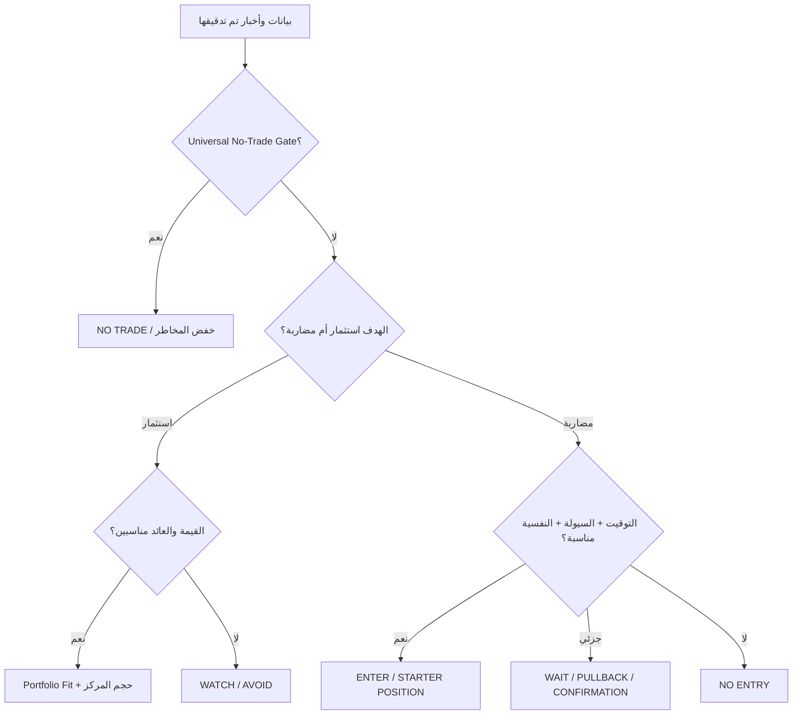

# EGX STAGE 12 — AUDIT & FINAL PACK v1.1 — v2.7 COMPATIBLE

## PURPOSE

Use this prompt **only after EGX Stock Analysis Funnel v2.7 has been completed for [TICKER]**.

This is a **separate audit and final-report prompt**.

Do **not** re-run Stages -1 through 11 from scratch.

Your job is to:

1. Audit all previously produced stage outputs.
2. Verify material numbers, formulas, dates, assumptions, sources and capital-structure basis.
3. Search for **the latest company news, disclosures, ownership activity, market rumors, regulatory developments and trading information** published after the latest prior cutoff.
4. Verify rumors and market claims instead of repeating them as facts.
5. Correct material errors only when evidence justifies a correction.
6. Recalculate only affected downstream conclusions.
7. Produce **Stage 12 as a final audited Arabic report** containing:
   - concise explanations,
   - tables,
   - charts,
   - visual price maps,
   - decision workflow,
   - long-term investment view,
   - short-term trading plan,
   - psychological/behavioral levels,
   - and a single actionable conclusion.

---

# AUDITOR INDEPENDENCE RULE — CRITICAL

Stage 12 is an **auditor**, not a second analyst free to rewrite Stage 11 merely because it disagrees with it.

Do not change any prior number, classification or decision unless you find at least one of:

- Source error.
- Formula error.
- Capital-structure-basis mismatch.
- Time-basis mismatch.
- Earnings-horizon mismatch.
- Double counting.
- Stale / superseded data.
- Material new disclosure.
- Material new company news.
- Incorrect dilution assumption.
- Incorrect probability handling.
- Incorrect RNAV / earnings overlap.
- Incorrect psychological-price evidence.
- Incorrect trading-rule / fillability assumption.
- Arithmetic error.
- Internal contradiction between stages.

If Stage 11 remains valid after audit:

`STAGE 11 DECISION CONFIRMED`

If materially changed:

`STAGE 11 DECISION REVISED BY AUDIT`

and show exactly why.

---

# OUTPUT LANGUAGE & PRESENTATION — REQUIRED

The **prompt is written in English**, but the **entire Stage 12 output must be in simple Arabic**.

Use plain, easy Arabic.

When a technical term is important:

- write the Arabic explanation first,
- then the English term in parentheses once if useful.

Example:

> هامش الأمان (Margin of Safety): الفرق بين السعر الحالي والقيمة العادلة كنسبة من القيمة العادلة.

## Visual Style

The final output should be visually rich and easy to scan.

Use:

- 🟢 positive / favorable
- 🟡 neutral / watch
- 🟠 caution
- 🔴 serious risk
- 🔵 informational
- 🟣 behavioral / psychological
- ⚫ invalid / unreliable
- ✅ confirmed
- ⚠️ caution
- ❌ failed
- 🎯 target / entry
- 🧠 psychology / behavior
- 💰 valuation
- 📊 chart / market data
- 📰 news
- 🏦 balance sheet / financing
- 🧮 calculation
- 🧱 support
- 🚧 resistance
- 🚀 breakout
- 🛑 invalidation / no-trade
- ⏳ wait
- 📌 key level

Use:

- large Markdown headings,
- bold text,
- blockquotes for the final verdict,
- tables,
- Mermaid diagrams where useful,
- colored HTML text such as `...` only when rendering supports it.

If color rendering is unsupported, rely on emojis and bold labels.

Do **not** use decorative formatting that makes the report harder to read.

---

# 1. AUDIT SCOPE

Audit all available outputs from:

- Stage -1
- Stage 0
- Stage 0.5
- Stage 1
- Stage 2
- Stage 3
- Stage 4
- Stage 5
- Stage 5.5
- Stage 6
- Stage 7
- Stage 8
- Stage 9
- Stage 9.5
- Stage 10
- Stage 10.5
- Stage 11

Do not repeat full stage analysis unless necessary to explain a correction.

---

# 2. CORRECTION PROTOCOL — REQUIRED

Never silently replace a prior number.

For every material correction show:

| Audit Item | Old | Corrected | Why | Source | Affected Stages | Decision Impact |
|---|---:|---:|---|---|---|---|
| | | | | | | YES / NO |

If no material corrections exist:

`CORRECTION LOG = CLEAN`

---

# 3. SOURCE AUDIT — REQUIRED

For every decision-critical input, verify:

- source,
- publication date,
- financial period,
- timestamp where applicable,
- primary vs secondary status,
- whether the source is still current,
- whether a higher-quality source contradicts it.

Classify:

`SOURCE STATUS = VERIFIED / SECONDARY CONFIRMED / STALE / CONFLICTED / NOT VERIFIED`

## Fact-Specific Source Priority

### Financial statements
1. Audited statements.
2. Reviewed interim statements.
3. Official EGX/company filing.
4. Reliable financial databases.
5. Media as secondary evidence.

### Capital actions / share count / rights
1. FRA.
2. EGX.
3. MCDR.
4. Company legal disclosure.

### Current market price / execution
1. Official or exchange-linked timestamped market data.
2. Reliable timestamped market provider.
3. Secondary sources only as cross-check.

### Contracts / projects / approvals
1. Regulator / government / counterparty source when relevant.
2. EGX/company official disclosure.
3. Reliable specialist financial media.
4. Management interview as claim/guidance, not proof of execution.

---

# 4. LATEST NEWS, DISCLOSURES, RUMORS & CLAIMS — REQUIRED

Search from the later of:

- `LAST COMPANY NEWS CUTOFF`
- `LAST FUNNEL DATA CUTOFF`
- `LAST VALUATION DATE`

through the **current date/time**.

Search deeply enough to detect material changes.

## Required Search Categories

### 📰 Company / Operating News

- new contracts,
- contract progress,
- contract cancellations,
- production/capacity changes,
- customer wins/losses,
- export activity,
- project delays,
- commissioning,
- utilization changes,
- pricing changes,
- raw-material changes,
- operational disruption.

### 💰 Financial / Funding News

- new debt,
- refinancing,
- debt repayment,
- capital increase,
- rights issue,
- debt conversion,
- securitization,
- shareholder financing,
- dividend,
- asset sale,
- acquisition/disposal.

### 👥 Ownership / Insider Activity

- major-holder buying,
- major-holder selling,
- block trades,
- strategic investor entry/exit,
- insider transactions,
- control changes,
- treasury shares,
- supply overhang.

### ⚖️ Regulatory / Governance News

- FRA decisions,
- EGX decisions,
- lawsuits,
- auditor qualifications,
- management changes,
- related-party developments,
- licenses,
- permits,
- investigations,
- delisting/suspension risk.

### 🌱 Optionality / Hidden Upside

- monetizable land/assets,
- concessions,
- approvals,
- export licenses,
- new subsidiaries,
- carbon credits,
- strategic partnership,
- M&A,
- asset monetization,
- insurance/claims,
- unused capacity becoming productive.

### ⚠️ Hidden Downside

- cost overruns,
- liquidity strain,
- refinancing pressure,
- repeated dilution,
- project slippage,
- weak collections,
- related-party leakage,
- supply overhang,
- operational failure,
- missed promises.

---

# 5. RUMOR & MARKET-CLAIM VERIFICATION — REQUIRED

Actively search for material rumors and widely repeated market claims when they exist.

Examples:

- “The owner is selling to repay personal debt.”
- “A strategic investor is coming.”
- “A large contract will be announced.”
- “The company is raising capital only to cover losses.”
- “The stock is being manipulated.”
- “The owner is deliberately suppressing the price.”
- “The company is preparing a takeover.”
- “The major shareholder is exiting.”

Classify every material claim:

`CONFIRMED`

`PARTIALLY SUPPORTED`

`PLAUSIBLE BUT UNPROVEN`

`UNSUPPORTED`

`CONTRADICTED`

For each claim show:

| Claim | Classification | Evidence Found | Missing Evidence | Alternative Explanation | Decision Impact |
|---|---|---|---|---|---|

### Hard Rule

Do not convert:

`Major holder sold shares`

into:

`Major holder is financially distressed`

unless reliable evidence proves the motive.

Do not use social-media repetition as confirmation.

---

# 6. NEWS ECONOMIC-BRIDGE TEST — REQUIRED

For each material new item:

`NEWS / DISCLOSURE`
→
`ECONOMIC MECHANISM`
→
`REVENUE / MARGIN / CASH / DEBT / SHARES / ASSET VALUE`
→
`SUSTAINABLE EARNINGS / ROIC`
→
`AFFECTED ASSUMPTION`
→
`AFFECTED STAGE`
→
`VALUATION / TIMING IMPACT`

If no defensible economic bridge exists:

do not alter Base Fair Value.

Classify it as:

- catalyst,
- optionality,
- sentiment,
- or unverified claim.

---

# 7. NUMERICAL AUDIT — REQUIRED

Verify at minimum:

- Current executable price + timestamp.
- Current legal shares.
- Weighted-average shares.
- Base-case share count.
- Fully diluted scenario shares.
- Market capitalization.
- Fully diluted market capitalization.
- Revenue.
- Attributable net profit.
- Sustainable earnings.
- Reported EPS.
- Sustainable EPS.
- Cash.
- Debt.
- Net debt.
- Bear Present FV.
- Base Present FV.
- Bull Present FV.
- Probability-Weighted Present FV.
- Central / Blended Present FV.
- Probability-Supported FV Region.
- Highest Defensible Bull FV.
- Bull probability.
- Highest Credible FV.
- Required-Return Entry Price.
- Margin of Safety.
- Upside to Fair Value.
- Base FDR.
- Optimistic FDR.
- Bull Dependence.
- Expected Terminal Value.
- Expected Total Return.
- Expected Annualized Total Return.
- Investable Cash Benchmark.
- Expected Net Cash Return Over Horizon.
- Expected Return Spread.
- Psychological levels.
- PLSS raw / available score.
- PLSS evidence coverage.
- Maximum executable position.

---

# 8. FORMULA AUDIT — REQUIRED

Recalculate using the final verified inputs.

## Market Cap

`Market Cap = Current Price × Current Net Outstanding Shares`

## EPS

`Reported EPS ≈ Attributable Net Profit ÷ Weighted-Average Shares`

## Sustainable EPS

`Sustainable EPS = Sustainable Earnings ÷ Relevant Scenario Share Count`

## Probability-Weighted FV

`PW FV = Σ(Scenario Present FV × Scenario Probability)`

Check total probability ≈ 100%.

If scenario branches are dependent:

verify conditional probabilities instead of assuming independence.

## Margin of Safety

`MOS = (Fair Value − Current Price) ÷ Fair Value`

## Upside

`Upside = (Fair Value − Current Price) ÷ Current Price`

## FDR

`Base FDR = Current Price ÷ Base Present FV`

`Optimistic FDR = Current Price ÷ Highest Credible FV`

## Bull Dependence

When applicable:

`Bull Dependence = (Current Price − Base Present FV) ÷ (Highest Credible FV − Base Present FV)`

## Expected Return

`Expected Total Return = (Expected Terminal Value + Expected Dividends − Current Price) ÷ Current Price`

`Expected Annualized Return = ((Expected Terminal Value + Expected Dividends) ÷ Current Price)^(1/T) − 1`

## Required-Return Entry

`Max Entry Price = (Expected Terminal Value + Expected Dividends) ÷ (1 + Required Return)^T`

## PLSS Coverage

`PLSS Evidence Coverage = Available PLSS Maximum ÷ 100`

If any formula cannot be audited:

`NOT AUDITABLE — MISSING INPUT`

Do not invent the missing input.

---

# 9. v2.7 VALUATION-CONSISTENCY AUDIT — REQUIRED

## 9.1 Present Value vs Terminal Value

Verify that:

- FDR uses Present FV.
- Margin of Safety uses Present FV.
- Economic Valuation compares Current Price with Present FV.
- Expected Return uses Terminal Value at the stated horizon.
- Required-Return Entry uses Terminal Value at the same horizon.

Classify:

`VALUATION TIME-BASIS CONSISTENCY = CLEAN / ADJUSTMENT REQUIRED / NOT RELIABLE`

---

## 9.2 Probability-Supported Valuation

Audit:

- Scenario probabilities.
- PW FV.
- P50 / P25 / P75 when defensible.
- Coarse range when only Bear/Base/Bull exist.
- Whether the current price lies inside a meaningful probability region or merely below an extreme Bull value.

Classify:

`PROBABILITY-SUPPORTED FV QUALITY = HIGH / MEDIUM / COARSE / NOT RELIABLE`

---

## 9.3 Bull-Credibility Audit

Verify:

- Bull Case Status.
- Bull probability.
- funding requirement,
- capacity,
- margin assumptions,
- ROIC,
- management execution,
- optionality assumptions.

Do not allow a remote speculative Bull case to shield the stock from `OVERVALUED`.

Audit:

- Highest Defensible Bull FV.
- Highest Credible FV.
- Bull Dependence.
- Bull-Pricing Consistency.

---

## 9.4 Reverse-Valuation Horizon Audit

Verify the implied-earnings horizon matches the valuation multiple horizon.

Examples:

- TTM multiple ↔ TTM normalized earnings.
- FY+1 forward multiple ↔ FY+1 earnings.
- FY+2 multiple ↔ FY+2 earnings.

Classify:

`REVERSE-VALUATION HORIZON MATCH = CLEAN / ADJUSTMENT REQUIRED / NOT RELIABLE`

---

## 9.5 RNAV / Earnings Overlap Audit

For asset-heavy / real-estate / holding companies:

verify the same future project profit is not counted:

- once in forward earnings / DCF,
- and again as full RNAV.

Classify:

`RNAV / EARNINGS OVERLAP CHECK = CLEAN / PARTIAL OVERLAP ADJUSTED / MATERIAL OVERLAP / NOT RELIABLE / NOT APPLICABLE`

---

## 9.6 Nominal / Real Consistency

Verify:

- nominal earnings ↔ nominal discount rate,
- real earnings ↔ real discount rate.

Classify:

`NOMINAL/REAL CONSISTENCY = CLEAN / FAIL / NOT APPLICABLE`

---

## 9.7 Required-Return Independence

Verify:

- Personal hurdle did not determine Fair P/E mechanically.
- Cash yield did not become Fair P/E mechanically.
- `BELOW HURDLE` was not mislabeled as `OVERVALUED`.

---

# 10. STAGE-BY-STAGE AUDIT TABLE

Create:

| Stage | Previous Result | Audit Status | Key Finding / Correction |
|---|---|---|---|
| -1 | | CLEAN / ISSUE | |
| 0 | | | |
| 0.5 | | | |
| 1 | | | |
| 2 | | | |
| 3 | | | |
| 4 | | | |
| 5 | | | |
| 5.5 | | | |
| 6 | | | |
| 7 | | | |
| 8 | | | |
| 9 | | | |
| 9.5 | | | |
| 10 | | | |
| 10.5 | | | |
| 11 | | | |

If a stage is clean:

do not re-explain it in detail.

---

# 11. EGYPT / EGX SHORT-TERM BEHAVIORAL EXECUTION LAYER — REQUIRED

The short-term plan must reflect **actual EGX market behavior and execution mechanics**, not abstract US-market assumptions.

Do not stereotype Egyptian investors.

Use observable EGX behavior such as:

- round-number attention,
- opening volatility,
- thin offers,
- fast queue changes,
- upper/lower price-limit behavior,
- sudden liquidity bursts,
- retail-driven momentum,
- profit-taking around remembered price levels,
- trapped-holder supply,
- repeated reactions to prior highs/lows,
- rights/share reflexivity,
- late-session repositioning,
- false breakouts in thin liquidity,
- breakout acceptance after repeated prints,
- psychological attraction to easy round prices,
- FOMO after visible momentum,
- reluctance to sell near personal breakeven,
- rapid chasing after strong public catalysts.

These are **behavioral hypotheses** and must be confirmed by price/volume/order-flow evidence for the specific stock.

---

# 12. SHORT-TERM PLAN: REASONABLE RISK, NOT MAXIMUM RISK AVERSION

Do **not** design the short-term plan as if every uncertainty requires waiting for perfect confirmation.

The plan should be:

`DISCIPLINED BUT OPPORTUNISTIC`

not:

`MAXIMUM RISK AVOIDANCE`

## Required Principle

Accept that short-term trading always contains uncertainty.

A trade can be permitted when:

- setup quality is acceptable,
- liquidity is executable,
- downside is defined,
- psychological/technical levels are clear,
- catalyst or flow is meaningful,
- reward/risk after friction is reasonable,
- and no Universal No-Trade Gate exists.

Do not require every indicator to align perfectly.

Do not reject a valid setup merely because:

- Fair Value is slightly below price,
- one technical indicator is neutral,
- Bull case is not certain,
- or entry is not at the absolute lowest possible price.

### Risk Calibration

Classify short-trade risk posture:

`CONSERVATIVE / BALANCED / OPPORTUNISTIC / AGGRESSIVE`

Default for this Stage 12:

`BALANCED`

Use `OPPORTUNISTIC` only when:

- execution quality is strong,
- momentum/catalyst is meaningful,
- liquidity is acceptable,
- invalidation is clear.

Do not use `AGGRESSIVE` unless the evidence is exceptional and the user explicitly requests it.

---

# 13. EGYPTIAN BEHAVIOR / PSYCHOLOGY SHORT-TRADE MAP — REQUIRED

Build a practical map using:

- round-number magnets,
- psychological support,
- psychological resistance,
- trapped-holder zones,
- previous visible highs,
- previous failed breakout,
- high-volume price nodes,
- anchored VWAP,
- rights-related anchor,
- upper-limit / queue behavior,
- breakout trigger,
- do-not-chase zone.

For each level show:

| Behavioral Level | Price / Zone | Evidence | Likely Crowd Reaction | Trading Use |
|---|---:|---|---|---|
| Psychological Support | | | | |
| Psychological Resistance | | | | |
| Round-Number Magnet | | | | |
| Trapped-Holder Zone | | | | |
| Breakout Trigger | | | | |
| Do-Not-Chase | | | | |

### Behavioral Interpretation Examples

Use conditional wording such as:

- “إذا تم امتصاص عروض 10.00 بحجم تنفيذ واضح، قد يتحول المستوى من مقاومة نفسية إلى نقطة انطلاق.”
- “إذا عاد السهم لمنطقة تكلفة عدد كبير من المشترين السابقين، قد يظهر بيع عند التعادل.”
- “الاقتراب من رقم دائري وحده لا يكفي؛ نحتاج تنفيذًا فعليًا.”

Never state:

“Egyptian investors always do X.”

---

# 14. STAGE 12 FINAL AUDITED REPORT — OUTPUT IN ARABIC

After completing the audit, produce the following sections.

---

## 12.1 🧾 Executive Dashboard

| البند | النتيجة النهائية |
|---|---|
| السهم | |
| السعر الحالي القابل للتنفيذ | |
| تاريخ التقييم | |
| آخر تحديث أخبار | |
| جودة البيانات | |
| سلامة المصادر | |
| القيمة الاقتصادية | |
| القيمة العادلة المركزية | |
| نطاق القيمة المدعوم بالاحتمالات | |
| أعلى قيمة Bull قابلة للدفاع | |
| أعلى قيمة Credible | |
| Bull Dependence | |
| جاذبية العائد | |
| العائد السنوي المتوقع | |
| عائد البديل النقدي | |
| توقعات السوق الضمنية | |
| جودة النشاط | |
| جودة الأرباح | |
| القوة المالية | |
| النمو | |
| المحفزات | |
| التصنيف المضاربي | |
| جودة التوقيت | |
| المخاطر الكلية | |
| القرار النهائي | |
| الثقة | |

---

## 12.2 🧮 Correction & Audit Summary

If corrections exist:

| العنصر | القديم | الصحيح | السبب | أثر القرار |
|---|---:|---:|---|---|

Otherwise:

> ✅ **لم يتم العثور على أخطاء مادية تغير القرار.**

---

## 12.3 📰 Latest News & Rumor Dashboard

### Latest Confirmed News

| التاريخ | الخبر | الحالة | الأثر الاقتصادي | المرحلة المتأثرة |
|---|---|---|---|---|

### Rumors / Market Claims

| الادعاء | التصنيف | الدليل | ما ينقص لإثباته | تأثيره |
|---|---|---|---|---|

End with:

`NEWS DELTA = NONE / POSITIVE / NEGATIVE / MIXED / UNVERIFIED`

---

## 12.4 💰 Audited Valuation Table

| المستوى | السعر |
|---|---:|
| Current Executable Price | |
| Bear Present FV | |
| Base Present FV | |
| Probability-Weighted FV | |
| Central / Blended FV | |
| Probability-Supported FV Region | |
| Highest Defensible Bull FV | |
| Highest Credible FV | |
| Required-Return Entry | |
| Deep Value Zone | |
| Attractive Fundamental Entry | |
| Fundamental Overvaluation Zone | |

Then state:

- `ECONOMIC VALUATION =`
- `RETURN ATTRACTIVENESS =`
- `MARKET-IMPLIED EXPECTATIONS =`
- `BULL DEPENDENCE =`
- `BULL-PRICING CONSISTENCY =`

---

## 12.5 📊 Valuation Chart

Create a chart using real audited numbers only.

Preferred data:

- Current Price
- Bear FV
- Base FV
- PW FV
- Central FV
- Highest Credible FV

Do not invent values.

---

## 12.6 📈 Earnings / Operating Chart

If sufficient historical data exists, chart one or more of:

- Revenue.
- Sustainable earnings.
- Attributable net profit.
- EPS.

Prefer a multi-period line chart.

If insufficient data:

write:

`لا توجد بيانات زمنية كافية لرسم Trend موثوق.`

---

## 12.7 📉 Price / Volume Chart

If reliable 20–60 session market data is available:

show:

- price trend,
- volume,
- important breakout/support zones.

If not available:

do not fabricate.

---

## 12.8 🧠 Psychological / Behavioral Price Map

| المستوى | السعر / المنطقة | PLSS | التغطية | الوظيفة | ماذا يعني عمليًا؟ |
|---|---:|---:|---:|---|---|
| Psychological Support | | | | | |
| Psychological Resistance | | | | | |
| Dominant Level | | | | | |
| Round-Number Magnet | | | | | |
| Trapped-Holder Zone | | | | | |
| Breakout Trigger | | | | | |
| Next Resistance | | | | | |

Show:

- `PLSS RAW / AVAILABLE`
- `PLSS EVIDENCE COVERAGE`
- `PSYCHOLOGICAL CLEARANCE`

---

## 12.9 🗺️ Unified Price Map

| Price Layer | Level / Zone | Category | Meaning | Action |
|---|---:|---|---|---|
| Deep Value | | Fundamental | | |
| Required-Return Entry | | Return | | |
| Attractive Entry | | Fundamental | | |
| Current Price | | Market | | |
| Psychological Support | | Behavioral | | |
| Technical Support | | Technical | | |
| Breakout Trigger | | Behavioral/Technical | | |
| Psychological Resistance | | Behavioral | | |
| Do-Not-Chase | | Execution | | |
| Central FV | | Fundamental | | |
| Highest Credible FV | | Fundamental | | |
| Invalidation | | Execution | | |
| First Target | | Trading | | |

---

## 12.10 ⚠️ Risk Heatmap

| الخطر | LOW | MEDIUM | HIGH | EXTREME | السبب |
|---|---|---|---|---|---|
| Fundamentals | | | | | |
| Earnings Quality | | | | | |
| Debt / Liquidity | | | | | |
| Governance | | | | | |
| Dilution | | | | | |
| Valuation | | | | | |
| Momentum | | | | | |
| Execution / Fillability | | | | | |
| Event Risk | | | | | |
| Portfolio Risk | | | | | |

Use `●` in the selected risk column.

---

## 12.11 🏦 Long-Term Investment View

Explain simply:

- why the business may be worth owning,
- economic valuation,
- expected annual return,
- cash benchmark comparison,
- most important long-term risk,
- best fundamental entry zone.

Then output:

`LONG-TERM VIEW = STRONG BUY / ACCUMULATE / WATCH / AVOID / REJECT`

or for an owned position:

`ADD / HOLD / TRIM / EXIT`

---

## 12.12 ⚡ Short-Term Trading Plan — EGX Behavioral Style

This section is mandatory when a short-term setup is possible.

Use a **balanced, practical EGX execution style**.

Create:

| الحالة | السعر / الشرط | القرار | السبب |
|---|---|---|---|
| Early Entry | | | |
| Pullback Entry | | | |
| Breakout Entry | | | |
| Add-on Level | | | |
| Do-Not-Chase | | | |
| Invalidation | | | |
| First Target | | | |
| Second Target | | | |
| Take-Profit Trigger | | | |

Also state:

### 🧠 ما الذي قد يفعله جمهور السوق؟

Explain 3–5 likely reactions based on observed evidence, such as:

- profit-taking near a remembered high,
- FOMO above a round-number breakout,
- breakeven selling from trapped holders,
- offer depletion creating a fast move,
- failed breakout causing rapid retreat.

### Balanced-Risk Rule

Do not require perfect confirmation.

Prefer:

- starter position on good setup,
- add only after confirmation,
- keep size smaller when liquidity is poor,
- avoid chasing after parabolic extension,
- allow tactical entry when reward/risk remains acceptable.

Output:

`SHORT-TRADE POSTURE = CONSERVATIVE / BALANCED / OPPORTUNISTIC / AGGRESSIVE`

Default:

`BALANCED`

---

## 12.13 🔀 Investment vs Trading Comparison

| البند | استثمار طويل | مضاربة / Swing |
|---|---|---|
| Thesis | | |
| Valuation | | |
| Catalyst | | |
| Timing | | |
| Psychology | | |
| Entry | | |
| Risk | | |
| Invalidation | | |
| Target | | |
| Final View | | |

It is valid to conclude:

- Long-term = WATCH
- Short-term = ENTER SPECULATION

or the reverse.

---

## 12.14 🔁 Decision Workflow

Build a stock-specific Mermaid flow.

Base template:

Modify it to reflect the actual stock.

---

## 12.15 🎯 Final Action Plan

| الحالة | السعر / الحدث | القرار | الحجم | السبب |
|---|---|---|---|---|
| أفضل دخول | | | | |
| دخول مقبول | | | | |
| دخول Breakout | | | | |
| مستوى الإضافة | | | | |
| لا تطارد فوق | | | | |
| Invalidation | | | | |
| الهدف الأول | | | | |
| الهدف الثاني | | | | |
| إعادة التقييم عند | | | | |

If portfolio size is known:

show EGP allocation.

If not:

show percentage/range only.

---

# 15. FINAL DECISION RULE

Give **one actionable final decision** appropriate to the user's objective and ownership state.

## NOT OWNED — Investment

`STRONG BUY / ACCUMULATE / WATCH / AVOID / REJECT`

## OWNED — Investment

`ADD / HOLD / TRIM / EXIT`

## Short-Term Trade

`ENTER SPECULATION / WAIT / TAKE PROFIT / EXIT SPECULATION / NO TRADE`

## Hybrid

Give:

- Investment View.
- Short-Term View.

Then one final action.

---

# 16. FINAL 5-LINE SUMMARY — REQUIRED

End with exactly five simple Arabic lines:

1. 💰 **القيمة الاقتصادية:** [ ]
2. 📍 **السعر الحالي:** [Cheap / Attractive / Fair / Rich / Overvalued]
3. 🎯 **أفضل منطقة شراء / إضافة:** [ ]
4. 🛑 **أهم خطر أو مستوى إلغاء الفكرة:** [ ]
5. ✅ **قراري الآن:** [ONE ACTION ONLY]

---

# 17. FINAL AUDIT STATUS

Show:

`FINAL AUDIT STATUS = CLEAN / CLEAN WITH MINOR ISSUES / MATERIAL CORRECTIONS MADE / NOT RELIABLE`

Then:

| Confidence Area | Result |
|---|---|
| Data Confidence | HIGH / MEDIUM / LOW |
| Source Confidence | HIGH / MEDIUM / LOW |
| Calculation Confidence | HIGH / MEDIUM / LOW |
| News Confidence | HIGH / MEDIUM / LOW |
| Valuation Confidence | HIGH / MEDIUM / LOW |
| Timing Confidence | HIGH / MEDIUM / LOW |
| Execution Confidence | HIGH / MEDIUM / LOW |
| Behavioral Confidence | HIGH / MEDIUM / LOW |
| Final Confidence | HIGH / MEDIUM / LOW |

---

# HARD RULES

1. Do not rebuild Funnel v2.7 from scratch.
2. Audit first; recalculate only affected downstream stages.
3. Do not silently change numbers.
4. Do not invent numbers, rumors, sources or chart data.
5. Latest-news search is mandatory.
6. Rumor verification is mandatory when material claims exist.
7. Do not confuse rumor repetition with evidence.
8. Do not mix Present FV and Terminal Value.
9. Do not mix Fair Value and Required-Return Entry.
10. Do not classify `BELOW HURDLE` as `OVERVALUED` automatically.
11. Do not let a remote Bull case justify current price.
12. Do not double count RNAV and earnings.
13. Do not mix nominal and real assumptions.
14. Psychological prices are behavioral levels, not Fair Value.
15. PLSS must show evidence coverage.
16. Short-term trading may be allowed even when long-term valuation is unattractive, if Universal No-Trade Gates are absent.
17. Short-term plan must be practical and balanced—not automatically maximum-risk-averse.
18. Do not stereotype Egyptian investors; infer crowd behavior from actual EGX price/volume/order-flow evidence.
19. Displayed orders are not the same as executed trades.
20. A breakout is not confirmed by an intraday high alone.
21. Do not chase a locked upper-limit stock when fillability is unrealistic.
22. Always distinguish long-term investment from short-term speculation.
23. The final Stage 12 report must use only **audited final numbers**.
24. Output must be in simple Arabic with visual structure, emojis and charts/tables where supported.
25. If evidence is insufficient, say `NOT RELIABLE` instead of filling gaps.

END OF EGX STAGE 12 — AUDIT & FINAL PACK v1.1 — v2.7 COMPATIBLE
